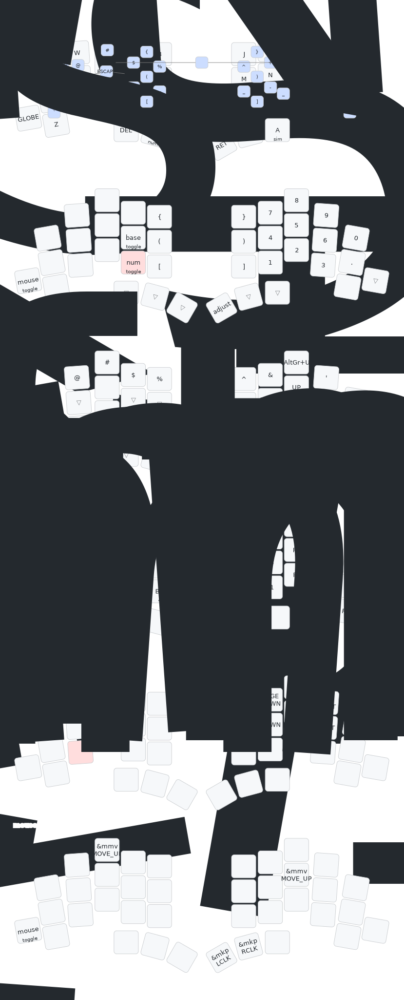

# my zmk-config

This is my personal [ZMK firmware](https://github.com/zmkfirmware/zmk/)
configuration for:

- [TOTEM](https://github.com/GEIGEIGEIST/totem) BLE (38 keys)
- Kinesis Advantage360 PRO

## HOW TO USE

- Use [keymap editor](https://nickcoutsos.github.io/keymap-editor/)
- `just totem-left`

## Layout

